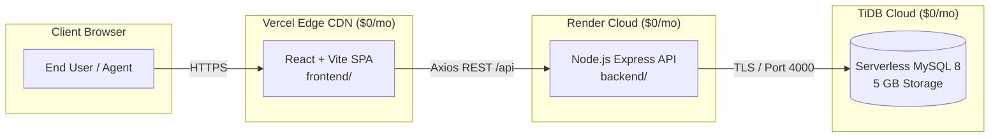

# Zero-Cost Production Deployment Plan & Technical Changes Guide

This document provides a comprehensive, deep-dive implementation plan for deploying the **Support Ticket Management System** to production at **$0/month total cost**, without requiring credit cards, recurring subscription fees, or local command-line database tools.

It details **what changes are required**, **where in the codebase they must be made**, **why each change is technically necessary**, and **what errors occur if they are omitted**.

---

## Table of Contents
1. [Zero-Cost Architecture Overview](#1-zero-cost-architecture-overview)
2. [Why Changes Are Needed: Deep Dive into Pitfalls & Failure Modes](#2-why-changes-are-needed-deep-dive-into-pitfalls--failure-modes)
   - [2.1 Database Provider Reality Check](#21-database-provider-reality-check)
   - [2.2 SSL/TLS Requirement in Cloud MySQL](#22-ssltls-requirement-in-cloud-mysql)
   - [2.3 Multi-Tenant Cloud Database Names & Privileges](#23-multi-tenant-cloud-database-names--privileges)
   - [2.4 CORS & Deployment Order Deadlock](#24-cors--deployment-order-deadlock)
   - [2.5 Single-Page Application (SPA) Routing on CDN](#25-single-page-application-spa-routing-on-cdn)
   - [2.6 Free-Tier Sleep Cycle (Render Cold Starts)](#26-free-tier-sleep-cycle-render-cold-starts)
3. [Inventory of Required Changes (Where, What & Why)](#3-inventory-of-required-changes-where-what--why)
   - [Change 1: backend/config/index.js (SSL Configuration Support)](#change-1-backendconfigindexjs-ssl-configuration-support)
   - [Change 2: backend/db.js (Inject SSL into MySQL Connection Pool)](#change-2-backenddbjs-inject-ssl-into-mysql-connection-pool)
   - [Change 3: backend/.env.production.example & backend/.env.example](#change-3-backendenvproductionexample--backendenvexample)
   - [Change 4: Cloud-Ready Unified SQL Initialization Script](#change-4-cloud-ready-unified-sql-initialization-script)
   - [Change 5: Frontend Vite API URL Configuration](#change-5-frontend-vite-api-url-configuration)
   - [Change 6: Backend CORS Origin Phased Configuration](#change-6-backend-cors-origin-phased-configuration)
4. [Consolidated Cloud Database Setup Script (Copy-Paste)](#4-consolidated-cloud-database-setup-script-copy-paste)
5. [Step-by-Step Painless Deployment Walkthrough](#5-step-by-step-painless-deployment-walkthrough)
   - [Phase 1: Provision TiDB Cloud Database](#phase-1-provision-tidb-cloud-database-3-mins)
   - [Phase 2: Apply Code Changes & Push to GitHub](#phase-2-apply-code-changes--push-to-github-2-mins)
   - [Phase 3: Deploy Backend API to Render](#phase-3-deploy-backend-api-to-render-4-mins)
   - [Phase 4: Deploy Frontend Client to Vercel](#phase-4-deploy-frontend-client-to-vercel-3-mins)
   - [Phase 5: Lock Down CORS Security](#phase-5-lock-down-cors-security-1-min)
6. [Post-Deployment Verification & Smoke Testing](#6-post-deployment-verification--smoke-testing)
7. [Environment Variables Reference Matrix](#7-environment-variables-reference-matrix)

---

## 1. Zero-Cost Architecture Overview

The system consists of three architectural layers deployed across three free-tier cloud platforms:



| Layer | Recommended Host | Free Tier Specifications | Financial Cost |
| :--- | :--- | :--- | :--- |
| **Database** | [TiDB Cloud Serverless](https://tidbcloud.com/) | 5 GB storage free forever, 100% MySQL 8.0 wire-compatible, in-browser Web SQL Editor, automated backups. | **$0.00 / month** (No credit card needed) |
| **Backend** | [Render](https://render.com/) | Free Web Service: 512 MB RAM, Node.js runtime, native git integration, free TLS certificate. | **$0.00 / month** (No credit card needed) |
| **Frontend** | [Vercel](https://vercel.com/) | Hobby Tier: Unlimited edge deployments, global CDN, automatic SSL, SPA routing rewrites. | **$0.00 / month** (No credit card needed) |

---

## 2. Why Changes Are Needed: Deep Dive into Pitfalls & Failure Modes

### 2.1 Database Provider Reality Check
* **PlanetScale** discontinued its free hobby tier entirely in April 2024. All clusters require an active paid plan starting at $39/month.
* **Render MySQL** does not exist. Render provides a free managed **PostgreSQL** service, but Render has never provided a managed MySQL service. Running MySQL on Render requires a paid Docker container attached to a paid persistent disk ($7+/mo).
* **Railway** dropped its permanent free tier; accounts require credit card verification, and trial credits expire after 30 days.
* **Why TiDB Cloud is Needed:** TiDB Cloud Serverless is one of the only major cloud database providers that offers a **permanent free tier (5 GB)** with 100% MySQL 8.0 syntax compatibility, TLS encryption, and zero credit card requirement.

---

### 2.2 SSL/TLS Requirement in Cloud MySQL
When running MySQL locally or in local Docker containers, connections are unencrypted (`ssl: false`). Cloud providers (TiDB Cloud, Aiven, Azure Database for MySQL) mandate TLS/SSL encryption for all incoming connections over the public internet to protect credentials and data in transit. Adding `ssl` support (`rejectUnauthorized: false`) in `config/index.js` and `db.js` allows secure TLS connections when `DB_SSL=true`.

---

### 2.3 Multi-Tenant Cloud Database Names & Privileges
Cloud database providers isolate customer databases. Executing `CREATE DATABASE support_tickets` results in access denied errors on shared clusters. A single unified SQL script `database/cloud_init.sql` operates directly on whichever active database the cloud provider assigned (`test` or `defaultdb`), executing seamlessly in the cloud Web SQL Editor.

---

### 2.4 CORS & Deployment Order Deadlock
Setting `CORS_ORIGIN=*` during the initial Render deployment allows Vercel preflight requests to pass while building the frontend. Once the live Vercel URL is generated, updating `CORS_ORIGIN=https://<your-app>.vercel.app` locks down production security.

---

### 2.5 Single-Page Application (SPA) Routing on CDN
Vercel requires `frontend/vercel.json` rewrites (`"source": "/(.*)", "destination": "/index.html"`) so deep links like `/dashboard` or `/tickets/1` route back to `index.html` for client-side React Router rendering.

---

### 2.6 Free-Tier Sleep Cycle (Render Cold Starts)
Render free services sleep after 15 minutes of inactivity. Initial requests take ~30 seconds to wake up the backend container.

---

## 3. Inventory of Required Changes (Applied)

### Change 1: `backend/config/index.js` (SSL Configuration Support)
- Added `ssl: (process.env.DB_SSL === 'true' || process.env.DB_SSL === '1') ? { rejectUnauthorized: false } : undefined`

### Change 2: `backend/db.js` (Inject SSL into Connection Pool)
- Added conditional `if (config.db.ssl) { poolConfig.ssl = config.db.ssl; }` to `mysql2/promise` pool configuration.

### Change 3: `backend/.env.production.example` & `backend/.env.example`
- Added `DB_SSL=true` (production) and `DB_SSL=false` (development).

### Change 4: Cloud-Ready Unified SQL Initialization Script
- Created `database/cloud_init.sql`.

### Change 5: Frontend Vite API URL Configuration
- Documented `VITE_API_URL` requirement in `frontend/.env.production.example`.

### Change 6: Backend CORS Origin Phased Configuration
- Detailed 2-step rollout (Wildcard initial -> Restricted Vercel domain final).

---

## 4. Consolidated Cloud Database Setup Script

Refer to [database/cloud_init.sql](file:///e:/Support%20Ticket%20Management%20System/database/cloud_init.sql).

---

## 5. Step-by-Step Painless Deployment Walkthrough

### Phase 1: Provision TiDB Cloud Database (~3 mins)
1. Sign up at [tidbcloud.com](https://tidbcloud.com/) ($0 Serverless, no credit card).
2. Create cluster, note Host, Port (`4000`), User, Database (`test`), and Password.
3. Open **SQL Editor**, run [database/cloud_init.sql](file:///e:/Support%20Ticket%20Management%20System/database/cloud_init.sql).

### Phase 2: Apply Code Changes & Push to GitHub (~2 mins)
```bash
git add .
git commit -m "feat(deploy): add zero-cost cloud deployment setup"
git push origin main
```

### Phase 3: Deploy Backend API to Render (~4 mins)
1. Connect repository on [render.com](https://render.com/).
2. Service Settings: Root Directory `backend`, Build `npm install`, Start `npm start`.
3. Set Environment Variables:
   - `NODE_ENV=production`
   - `DB_HOST=<TiDB Host>`
   - `DB_PORT=4000`
   - `DB_USER=<TiDB User>`
   - `DB_PASSWORD=<TiDB Password>`
   - `DB_NAME=test`
   - `DB_SSL=true`
   - `JWT_SECRET=<Random 32+ char secret>`
   - `CORS_ORIGIN=*`
4. Deploy and verify `https://<your-backend>.onrender.com/api/health`.

### Phase 4: Deploy Frontend Client to Vercel (~3 mins)
1. Import repository on [vercel.com](https://vercel.com/).
2. Root Directory: `frontend`, Preset: `Vite`.
3. Environment Variable: `VITE_API_URL=https://<your-backend>.onrender.com/api`.
4. Deploy and copy live Vercel URL.

### Phase 5: Lock Down CORS Security (~1 min)
1. Return to Render -> Environment.
2. Update `CORS_ORIGIN=https://<your-app>.vercel.app`. Save changes.

---

## 6. Post-Deployment Verification
- Agent login: `agent1@example.com` / `Password123`
- Customer login: `customer@example.com` / `Password123`
- Register new user & submit ticket verification.
