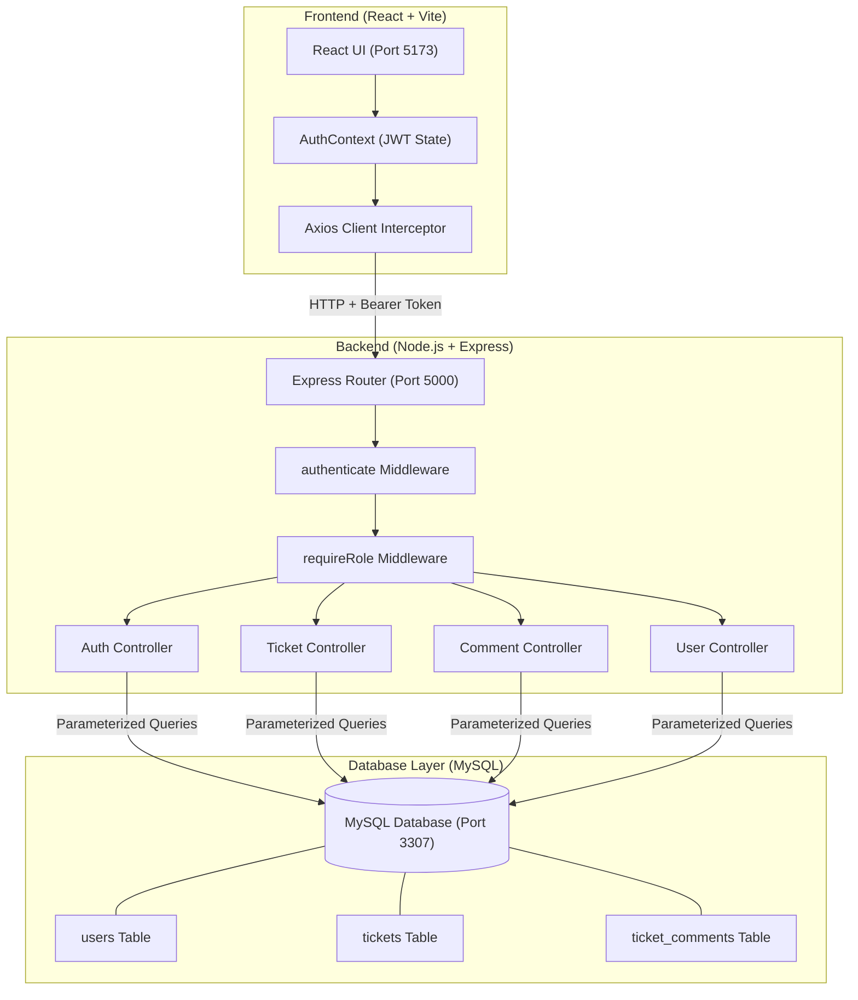
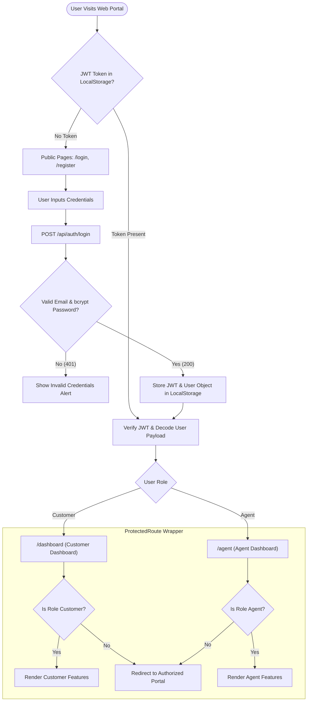
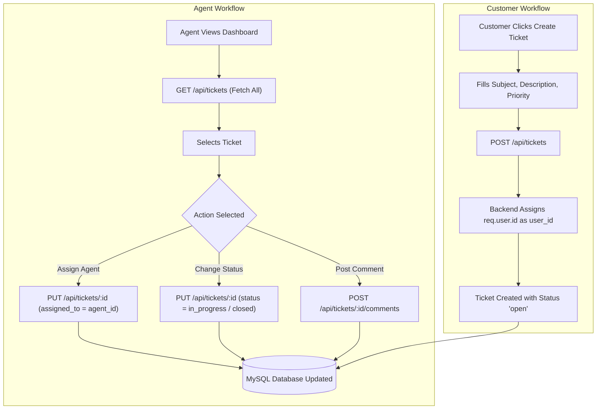
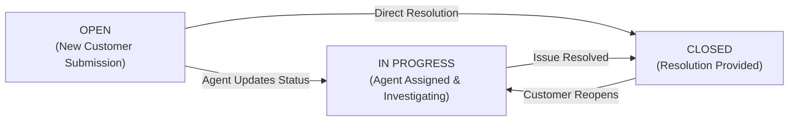
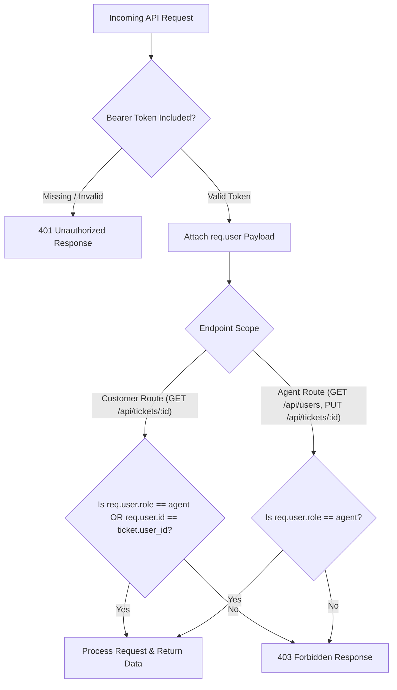

# System Architecture & Flowcharts - Support Ticket Management System

This document provides visual flowcharts mapping out the system architecture, authentication & authorization flow, ticket lifecycle, and component interactions.

---

## 1. High-Level System Architecture

---

## 2. Authentication & Role-Based Routing Flo

---

## 3. Ticket Creation & Management Flow

---

## 4. Ticket Lifecycle State Diagram

---

## 5. Security & Permission Check Matrix

